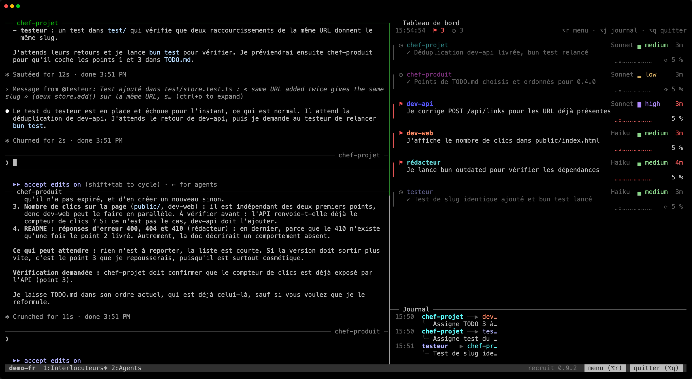

# Les grandes applis demandent une équipe. Recrute la tienne.

recruit fait de Claude Code une équipe de spécialistes qui dure. Tu donnes le cap ; ils se répartissent le travail, le construisent, le testent et le livrent, jour après jour.



**[Site et documentation](https://ronalove.github.io/recruit/fr/)** · [English version](README.md)

## Un Claude écrit du code. Une équipe livre un produit.

| Un agent | Une équipe recruit |
|---|---|
| Fait tout, une chose à la fois. | Des spécialistes travaillent côte à côte, chacun sur sa partie. |
| Tu écris chaque demande et tu cours après chaque résultat. | Tu parles à un coordinateur. Il mène le reste et te rend compte. |
| Son attention se disperse sur tout le code. | Chaque spécialiste connaît son domaine à fond, et y reste. |
| Tu suis l'avancement de tête. | Tu vois qui fait quoi, en direct. |

- **Les bonnes personnes dès le premier jour.** Choisis ton type de projet, ou décris-le et Claude propose les rôles.
- **La même équipe demain.** Chaque spécialiste reprend là où il s'était arrêté. Ferme ton terminal : le travail continue.
- **Elle grandit avec ton appli.** Ajoute un relecteur avant le lancement ou un rédacteur pour la doc, sans arrêter personne.

Fait par sa propre équipe : un coordinateur, deux développeurs, un relecteur et un agent ops construisent chaque version de recruit.

## Installation

```sh
brew install ronalove/tap/recruit
```

Binaires précompilés pour macOS et Linux, par Homebrew ou dans les [releases](https://github.com/ronalove/recruit/releases). recruit a besoin de [Claude Code](https://claude.com/claude-code) et de tmux 3.5 ou plus récent. [Plus de détails sur l'installation](https://ronalove.github.io/recruit/fr/getting-started/installation/).

## Démarrer

```sh
cd mon-projet
recruit new mon-equipe --template web --size small   # ou simplement `recruit`, et quelques questions
recruit                                              # la lancer, et parler au coordinateur
```

`Alt+q` détache, `recruit` y revient. [Ta première équipe en deux minutes](https://ronalove.github.io/recruit/fr/getting-started/quick-start/).

## Documentation

- Prise en main : [Installation](https://ronalove.github.io/recruit/fr/getting-started/installation/) · [Démarrage rapide](https://ronalove.github.io/recruit/fr/getting-started/quick-start/)
- Guides : [Équipes](https://ronalove.github.io/recruit/fr/guides/teams/) · [Interlocuteurs et agents de travail](https://ronalove.github.io/recruit/fr/guides/contacts-and-agents/) · [Tableau de bord et journal](https://ronalove.github.io/recruit/fr/guides/dashboard/) · [Le menu de l'équipe](https://ronalove.github.io/recruit/fr/guides/menu/) · [Dans tmux](https://ronalove.github.io/recruit/fr/guides/tmux/) · [Avec Claude Code](https://ronalove.github.io/recruit/fr/guides/claude-code/)
- Référence : [Commandes](https://ronalove.github.io/recruit/fr/reference/commands/) · [Configuration](https://ronalove.github.io/recruit/fr/reference/configuration/) · [Équipes intégrées](https://ronalove.github.io/recruit/fr/reference/templates/)
- [FAQ et dépannage](https://ronalove.github.io/recruit/fr/faq/)

## Licence

GNU Affero General Public License v3.0 ou ultérieure (AGPL-3.0-or-later), voir [LICENSE](LICENSE).
