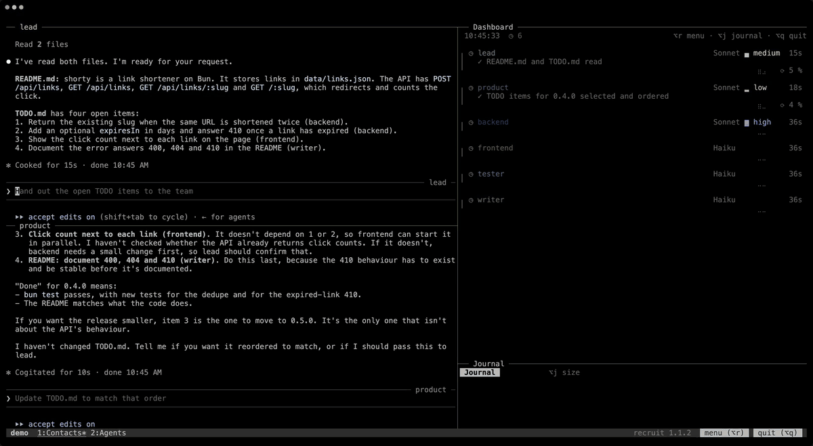

# Big apps need a team. Recruit one.

recruit turns Claude Code into a lasting team of specialists. You set the direction; they split the work, build it, test it and ship it, day after day.



**[Website and documentation](https://ronalove.github.io/recruit/)** · [Version française](README.fr.md)

## One Claude writes code. A team ships products.

| One agent | A recruit team |
|---|---|
| Does everything, one thing at a time. | Specialists work side by side, each on its own part. |
| You write every prompt and chase every result. | You brief a coordinator. It runs the rest and reports back. |
| Its attention spreads over the whole codebase. | Each specialist knows its area deeply, and stays on it. |
| You keep track of progress in your head. | You see who's on what, live. |

- **The right people from day one.** Pick your kind of project, or describe it and Claude proposes the roles.
- **Same team tomorrow.** Every specialist picks up where it left off. Close your terminal; the work goes on.
- **Grows with your app.** Add a reviewer before launch or a writer for the docs, without stopping anyone.

Made by its own team: a coordinator, two developers, a reviewer and an ops agent build every release of recruit.

## Install

```sh
brew install ronalove/tap/recruit
```

Prebuilt binaries for macOS and Linux, from Homebrew or the [releases](https://github.com/ronalove/recruit/releases). One binary, nothing else to install: recruit only needs [Claude Code](https://claude.com/claude-code). [More on installing](https://ronalove.github.io/recruit/getting-started/installation/).

## Start

```sh
cd my-project
recruit new my-team --template web --size small   # or just `recruit`, and answer a few questions
recruit                                           # launch it, and talk to the coordinator
```

`Alt+q` detaches, `recruit` comes back. [Your first team in two minutes](https://ronalove.github.io/recruit/getting-started/quick-start/).

## Documentation

- Getting started: [Installation](https://ronalove.github.io/recruit/getting-started/installation/) · [Quick start](https://ronalove.github.io/recruit/getting-started/quick-start/)
- Guides: [Teams](https://ronalove.github.io/recruit/guides/teams/) · [Contacts and working agents](https://ronalove.github.io/recruit/guides/contacts-and-agents/) · [Dashboard and journal](https://ronalove.github.io/recruit/guides/dashboard/) · [The team's menu](https://ronalove.github.io/recruit/guides/menu/) · [Around the screen](https://ronalove.github.io/recruit/guides/screen/) · [With Claude Code](https://ronalove.github.io/recruit/guides/claude-code/)
- Reference: [Commands](https://ronalove.github.io/recruit/reference/commands/) · [Configuration](https://ronalove.github.io/recruit/reference/configuration/) · [Built-in teams](https://ronalove.github.io/recruit/reference/templates/)
- [FAQ and troubleshooting](https://ronalove.github.io/recruit/faq/)

## License

GNU Affero General Public License v3.0 or later (AGPL-3.0-or-later), see [LICENSE](LICENSE).
