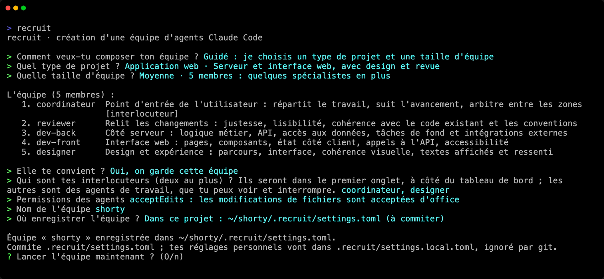

Dans deux minutes, ton projet a son équipe, et tu lui as confié son premier travail.

## 1. Créer une équipe

Dans ton projet, lance `recruit`. Si le projet n'a pas encore d'équipe, recruit propose d'en créer une :

```
$ cd mon-projet
$ recruit
recruit · création d'une équipe d'agents Claude Code

> Comment veux-tu composer ton équipe ? Guidé : je choisis un type de projet et une taille d'équipe
> Quel type de projet ? Projet personnel · Un outil ou un site perso : peu de formalités, l'essentiel du code et de l'interface
> Quelle taille d'équipe ? Petite · 3 membres : l'essentiel

L'équipe (3 membres) :
   1. coordinateur  Point d'entrée de l'utilisateur : répartit le travail, suit l'avancement, arbitre entre les zones  [interlocuteur]
   2. développeur   Développement : écrit et fait évoluer le code du projet, hors des zones confiées à d'autres membres
   3. designer      Design et expérience : parcours, interface, cohérence visuelle, textes affichés et ressenti
…
```



Les questions qui suivent la liste permettent de retirer ou d'ajouter des membres, de choisir tes interlocuteurs (les membres à qui tu parles), les permissions des agents, le nom de l'équipe et où l'enregistrer : dans le projet, à commiter, ou dans ton profil, pour la lancer de n'importe où. [Équipes](/recruit/fr/guides/teams/) détaille chaque choix.

Tu préfères une seule commande ? Celle-ci crée le même genre d'équipe sans poser de question, et la lance :

```sh
recruit new mon-equipe --template personal --size small --launch
```

## 2. La lancer

```sh
recruit
```

Dans un projet qui a une équipe, `recruit` la lance. L'équipe s'ouvre dans ton terminal : tes interlocuteurs dans le premier onglet, le tableau de bord et le journal à leur droite, les agents de travail dans les onglets suivants.

:::tip[Approuver le dossier une fois]
Claude Code demande à chaque nouvelle session s'il peut faire confiance à un dossier qu'il n'a jamais approuvé, et Entrée seule répond « No, exit ». recruit te prévient avant de lancer. Pour approuver le dossier une fois pour toute l'équipe, lance d'abord `claude` dans ce dossier et accepte.
:::


## 3. Parler à tes interlocuteurs

Tape ta demande au coordinateur, dans le premier onglet, comme tu le ferais avec Claude Code. Il découpe le travail et le confie aux agents de travail, qui lui rendent compte. Le tableau de bord montre qui travaille, qui se repose et qui t'attend ; le journal, en dessous, les messages qu'ils s'envoient.

Pour regarder un agent, clique sur sa carte dans le tableau de bord, ou va dans son onglet avec `Alt+1`…`Alt+9`. Tu peux aussi écrire dans son panneau : il fait ce que tu demandes et tient les interlocuteurs informés.

## 4. Partir et revenir

`Alt+q` (`⌥q` sous macOS), ou le bouton « quitter » en bas à droite, propose de se détacher (`d`) ou de quitter, ce qui arrête l'équipe (`q`). Détachée, l'équipe continue de travailler, même si tu fermes le terminal :

```sh
recruit          # retour là où tu l'as laissée, depuis n'importe quel terminal, même en SSH
recruit stop     # ferme la session de chaque membre
```

## Et ensuite

- [Équipes](/recruit/fr/guides/teams/) : locale ou globale, réglages personnels, les façons de composer une équipe.
- [Le menu de l'équipe](/recruit/fr/guides/menu/) : changer le modèle, le rôle ou l'onglet d'un membre pendant que l'équipe tourne.
- [L'écran de l'équipe](/recruit/fr/guides/screen/) : partir et revenir, suivre un membre en plein écran, les raccourcis, et Option sous macOS.
- [Configuration](/recruit/fr/reference/configuration/) : chaque clé du fichier de l'équipe.
