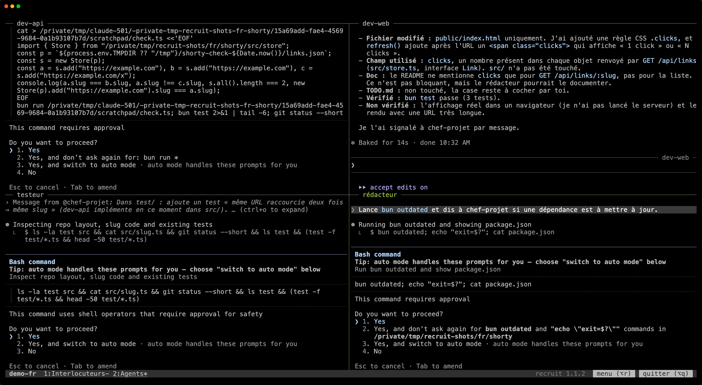

Tu ne pilotes pas chaque agent toi-même. Tu parles à un ou deux membres, tes interlocuteurs. Ils confient le travail aux autres, et te disent où ça en est. Les autres, les agents de travail, s'occupent chacun de leur zone. Tu peux quand même regarder n'importe lequel, et intervenir quand tu veux.

En coulisse, chaque membre est une session Claude Code avec son nom et son rôle, et écrit à ses coéquipiers par `SendMessage`.

## Interlocuteurs

Tes **interlocuteurs** sont les membres à qui tu parles : le coordinateur, par exemple. Ils sont dans le premier onglet. Une équipe en a un ou deux :

```toml
[teams.web.members.coordinateur]
role = "Point d'entrée de l'utilisateur : répartit le travail, suit l'avancement"
contact = true
```

Si aucun membre n'a `contact = true`, le premier membre est l'interlocuteur. Le premier interlocuteur est l'**interlocuteur principal** : lui seul garde tout le bas de Claude Code, ta ligne d'état comprise (voir [Le bas de Claude Code](/recruit/fr/guides/claude-code/#le-bas-de-claude-code)).

## Agents de travail

Les autres membres sont des **agents de travail**. Ils reçoivent leur travail des interlocuteurs et leur rendent compte, sans t'attendre : leur prompt leur dit de poser leurs questions aux interlocuteurs quand ils sont bloqués, plutôt que d'attendre dans leur terminal.

Chaque agent garde un panneau visible. Regarde n'importe lequel, et écris dans son panneau quand tu dois intervenir : l'agent fait ce que tu demandes, puis tient les interlocuteurs informés.

## Onglets

Avec la disposition par défaut, `layout = "auto"` :

- **Le premier onglet**, « Interlocuteurs », réunit tes interlocuteurs, l'un au-dessus de l'autre, et à leur droite le [tableau de bord au-dessus du journal](/recruit/fr/guides/dashboard/). Avec `dashboard = false`, les interlocuteurs sont côte à côte.
- **Les agents de travail** suivent, regroupés selon leur `tab`, ou dans « Agents » s'ils n'en ont pas.
- **Un groupe plus grand qu'un onglet** (`columns × rows`, 3 × 2 = 6 par défaut) est réparti à parts égales : « Agents (1) », « Agents (2) »… Par exemple, 8 agents donnent 4 + 4, et 7 donnent 4 + 3. Un groupe `tab` trop grand est réparti de la même façon : « Code (1) », « Code (2) »…
- **Chaque onglet est une grille** : le moins de lignes possible, puis le moins de colonnes que ces lignes demandent. Avec 3 colonnes : 2 panneaux côte à côte, 4 en 2 × 2, 5 en 3 + 2, 6 en 3 × 2.

Dans une équipe en anglais, le premier onglet s'appelle « Contacts ». Le `tab` d'un membre peut prendre n'importe quel titre sauf ceux de recruit, dans les deux langues : « Interlocuteurs », « Contacts », « Agents (1) », « Agents (2) »… « Agents » seul est le groupe par défaut.



```toml
[teams.web]
columns = 3            # 3 colonnes au plus…
rows = 2               # …et 2 lignes dans un onglet

[teams.web.members.dev-back]
role = "Serveur et API"
tab = "Code"           # partage l'onglet « Code » avec les autres agents qui l'ont

[teams.web.members.dev-front]
role = "Interface web"
tab = "Code"
```

### Un onglet par membre

`layout = "tabs"` donne à chaque membre son propre onglet, à son nom, interlocuteurs en tête. Le tableau de bord et le journal vont dans le premier onglet.

## Changer en cours de route

Le [menu de l'équipe](/recruit/fr/guides/menu/) fait d'un membre un interlocuteur ou un agent de travail, ou le change d'onglet. Son panneau se déplace sans que son Claude s'arrête. Quand le seul interlocuteur part ou devient agent de travail, le menu demande qui le remplace.

## Passer d'un onglet à l'autre

`Alt+1`…`Alt+9` mènent à un onglet, `Alt+Maj+←` / `Alt+Maj+→` au précédent ou au suivant, et un clic sur la carte d'un membre dans le tableau de bord mène à son panneau. Voir [Dans tmux](/recruit/fr/guides/tmux/).
