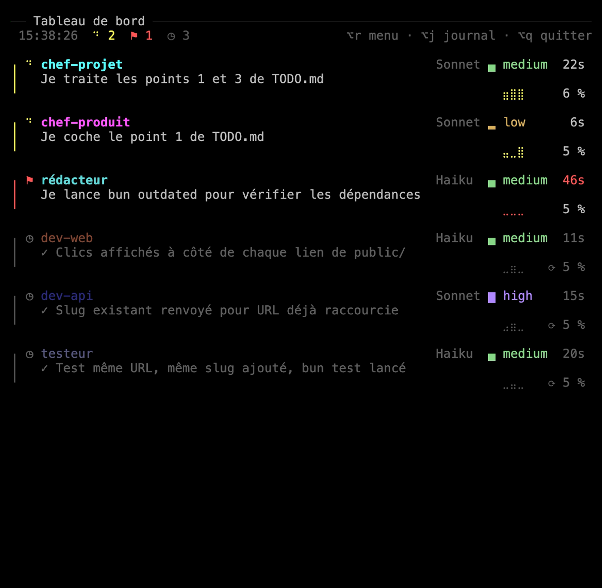
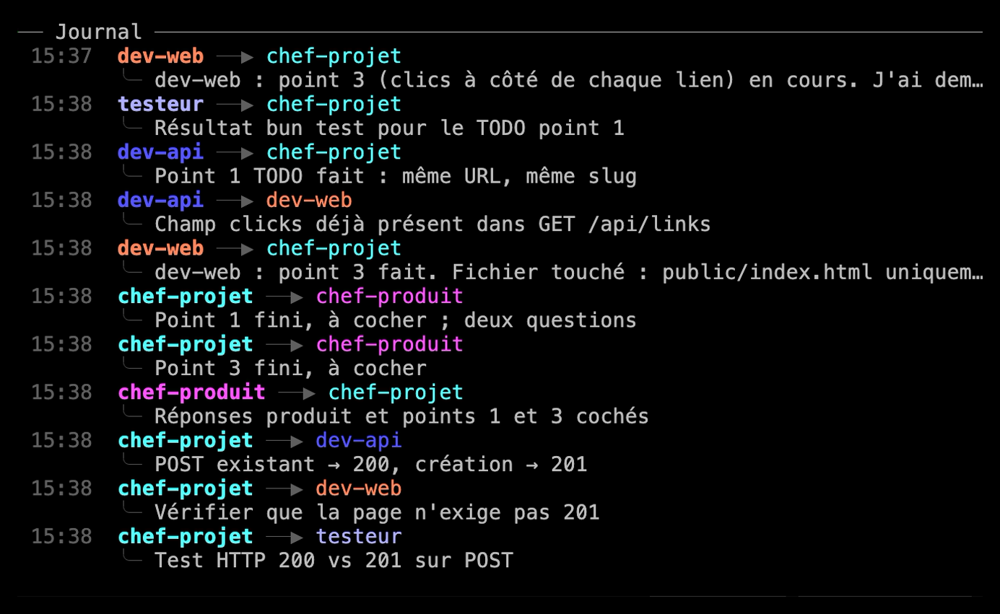

Le tableau de bord te dit d'un coup d'œil qui travaille, sur quoi, et qui t'attend. Le journal montre ce que les membres se disent. Tu sais où en sont les choses sans rien demander à personne.

Les deux sont à droite de tes interlocuteurs, dans le premier onglet : le **tableau de bord** en haut, le **journal** en dessous. Ils lisent ce que Claude Code enregistre déjà, sa liste de sessions (`claude agents --json`) et les fichiers de conversation.

## Le tableau de bord

En haut : l'heure, combien de membres sont dans chaque état, et les raccourcis. Dans un panneau étroit, l'heure disparaît d'abord, puis les raccourcis. Puis une carte par membre.

### Une carte

Un trait à gauche de la carte prend la couleur de l'état du membre, et le nom le dit aussi :

| État | Trait | Nom |
|---|---|---|
| Au travail | jaune vif | en gras, avec un indicateur animé à sa gauche |
| T'attend dans son terminal (une permission, une question) | rouge vif | en gras, avec l'icône de l'état à sa gauche, et le temps en rouge |
| Au repos | gris | atténué, avec l'icône de l'état à sa gauche |

La carte montre aussi depuis combien de temps le membre est dans cet état (12s, 22m, 1h05), une courbe de son activité sur la dernière demi-heure et, dans son titre, son modèle et son effort, autant que la place le permet : « Opus █ xhigh », sinon « Opus █ », sinon « Opus ». Le modèle est toujours atténué. L'effort est toujours vif, dans les couleurs de Claude Code (low jaune, medium vert, high et xhigh violet, max arc-en-ciel), avec son signe de niveau. Sans le mod, ce sont ceux que fixe le fichier de l'équipe, s'il les fixe.

Avec [le mod de recruit](/recruit/fr/guides/claude-code/#le-mod-de-recruit), chargé avec Claude Code 2.1.287 ou plus récent, les cartes en montrent plus :

- **Le modèle et l'effort** qu'utilise vraiment la session du membre.
- **Le contexte**, qui passe en orange à 80 % du seuil où Claude Code compacte de lui-même la conversation du membre, et en rouge à son avertissement, 20 000 jetons avant ce seuil.
- **Ce qu'il fait** : une ligne qui résume la demande en cours du membre, celle que tu lui as tapée ou le message d'un coéquipier. Trop long, le résumé passe sur deux lignes s'il y a la place, sinon il est coupé. Au repos, la ligne montre la dernière tâche, sous sa forme finie (« ✓ Version 2.4.1 publiée »). Un message qui ne demande rien (un merci, un accord) garde la ligne d'avant.
- **L'usage** de ton compte en bas : sur 5 heures et sur 7 jours, avec le temps restant avant chaque remise à zéro.

:::note[Ce que coûtent les résumés]
Haiku écrit les deux formes de la ligne dans le même appel, une fois par nouvelle demande, par la session du membre et donc sur ton compte : la demande lue jusqu'à 2 000 caractères, deux lignes en retour.
:::

### Compacter une conversation

Un clic sur le contexte d'un membre au repos, marqué ⟳, propose de compacter sa conversation, après confirmation. C'est ce que Claude Code ferait de lui-même au seuil, et cela coûte autant : le modèle du membre relit tout son contexte pour le résumer. Un membre qui s'est remis au travail entre-temps refuse. Ensuite, jusqu'à la réponse suivante du membre, la carte montre le contexte tel que Claude Code le compte, comme `/context`.

### Ordre et place

Les cartes viennent dans cet ordre : les interlocuteurs, les agents qui t'attendent, ceux au travail, puis ceux au repos, du plus récent au plus ancien. Dans cet ordre, chaque carte prend la forme la plus riche que la place lui laisse, une fois que les cartes suivantes ont leur forme la plus sobre :

- sur toute la largeur du panneau, avec ce qu'il fait sur deux lignes, ou sur une ;
- côte à côte avec une autre carte, avec une ligne ou aucune ;
- pour un agent de travail au repos, son seul nom, dans une liste sous les cartes.

Les agents au travail gardent toute la largeur et toute leur tâche tant que les autres peuvent faire de la place : ceux qui sont au repos depuis le plus longtemps passent les premiers dans la liste, et la liste se réduit à une ligne (« … et 3 autres ») avant qu'un agent au travail perde quoi que ce soit de sa tâche. La disposition ne change qu'avec les cartes, leurs états ou le panneau.

Quand des sessions ouvertes ailleurs portent le nom de membres, une ligne atténuée, au-dessus de l'usage, les nomme, s'il reste de la place.

## Le journal

Le journal liste les messages que les membres s'envoient, sur deux lignes chacun.

Il a trois tailles : complet (la moitié de la colonne), réduit (ses trois derniers messages, le reste de la colonne au tableau de bord) et masqué. Il est réduit au lancement. `Alt+j` (`⌥j` sous macOS) le fait passer de complet à réduit, puis à masqué, puis de nouveau à complet. `/equipe` (`/team` dans une équipe en anglais), tapé dans l'invite d'un membre, fait de même, même quand Claude travaille.

## Clics

Un clic sur la carte d'un membre, sur son nom dans la liste, ou sur l'expéditeur ou le destinataire d'un message du journal, mène au panneau de ce membre, dans son onglet.

## Sans eux

`dashboard = false` dans les réglages de l'équipe, ou « Tableau de bord » dans le [menu de l'équipe](/recruit/fr/guides/menu/), se passe des deux : les interlocuteurs sont alors côte à côte dans le premier onglet. Avec `layout = "tabs"`, les deux vont dans le premier onglet.

Un tableau de bord fermé par erreur revient quand tu relances `recruit` sur l'équipe qui tourne.
