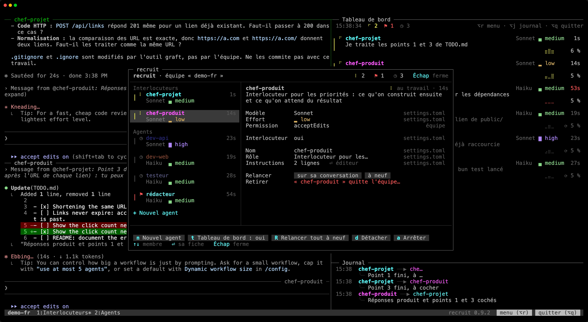

Ton équipe change avec le projet. Donner un modèle plus fort à un membre, réécrire un rôle, faire venir un spécialiste, se séparer d'un autre : le menu le fait sans arrêter l'équipe.

Chaque changement est enregistré dans les fichiers de l'équipe, et la plupart arrivent tout de suite à l'équipe lancée.

## L'ouvrir

- `Alt+r` (`⌥r` sous macOS) dans n'importe quel panneau de l'équipe ;
- le bouton « menu » à droite de la barre tmux ;
- `/recruit`, tapé dans l'invite d'un membre, avec [le mod de recruit](/recruit/fr/guides/claude-code/#le-mod-de-recruit).

Le menu s'ouvre dans une fenêtre tmux par-dessus l'équipe. Il lui faut une fenêtre de 50 × 14 au moins.

## L'écran

- **À gauche**, les membres comme au tableau de bord (le trait et l'icône de leur état, leur nom, le temps dans cet état, leur modèle atténué et leur effort en couleur), interlocuteurs d'abord, puis les agents de travail, et « + Nouvel agent » en dessous.
- **À droite**, la fiche du membre choisi : un réglage par ligne, et à droite de chacun, atténué, d'où vient sa valeur. Sous la fiche, une ligne dit ce que donne « défaut » et quand un changement prend effet.
- **En bas**, le résultat du dernier changement, puis les actions d'équipe, chacune avec sa touche.

Tout se clique. Dans une fenêtre étroite, la liste ne garde que les noms, et les origines passent sous la fiche.

## Touches

| Touche | Dans la liste | Dans une fiche |
|---|---|---|
| `↑` `↓` | choisir un membre | choisir un réglage |
| `⏎` | ouvrir sa fiche (`→` et `Tab` aussi) | dérouler la liste des valeurs, ou éditer le texte sur place |
| `←` `→` | | changer la valeur sur place |
| `Échap` | fermer le menu | abandonner une valeur préparée ou un nouvel agent en cours de composition, puis revenir à la liste |

- **La liste des valeurs** commence par « défaut : … », ce que donne le réglage quand le membre ne le fixe pas, et marque la valeur actuelle.
- **Le texte** (le nom, le rôle) s'édite sur place ; les instructions s'ouvrent dans ton éditeur. Les erreurs sont signalées pendant la frappe.
- **`←` `→`** appliquent tout de suite un modèle ou un effort que les requêtes du membre peuvent porter. Sinon, la valeur est seulement préparée, marquée « à valider ⏎ », et `⏎` l'applique.
- **Les confirmations** s'ouvrent au centre, sur « Annuler ».

## La fiche d'un membre

| Réglage | Effet |
|---|---|
| Modèle, Effort | le modèle et l'effort de Claude pour ce membre |
| Permission | son mode de permission de Claude Code |
| Interlocuteur | si tu lui parles, ou si c'est un agent de travail |
| Onglet | l'onglet qu'il partage avec d'autres agents de travail |
| Nom, Rôle, Instructions | qui il est, tel que le voient ses coéquipiers et son prompt |
| Relancer | le relancer, sur sa conversation ou à neuf |
| Retirer | le sortir de l'équipe, et fermer son panneau |

## Les actions d'équipe

| Touche | Action |
|---|---|
| `n` | Nouvel agent : un rôle intégré, un agent que Claude compose d'après ta demande, ou un agent que tu écris. « ⏎ Ajouter et lancer » lui donne tout de suite un panneau. |
| `t` | Tableau de bord : le tableau de bord et le journal, oui ou non |
| `R` | Réinitialiser : chaque membre sur une nouvelle conversation, les contextes vidés (demande « Réinitialiser l'équipe ? ») |
| `d` | Détacher : laisser l'équipe tourner |
| `q` | Quitter : arrêter l'équipe, la session de chaque membre fermée (demande « Quitter l'équipe ? ») |

Ces touches marchent depuis la liste des membres ; dans une fiche, une lettre ne fait rien. Un clic marche partout.

## Où s'écrivent les changements

recruit écrit chaque changement dans le fichier qui donne la valeur aujourd'hui, commentaires gardés :

- pour une équipe globale, son fichier ;
- pour une équipe locale, `.recruit/settings.local.toml` s'il a le réglage, sinon `.recruit/settings.toml` s'il l'a, sinon le fichier qui définit le membre ou l'équipe, `settings.toml` d'abord.

Choisir « défaut » retire le réglage de ce fichier, et une table devenue vide avec lui. Renommer ou retirer un membre touche chaque fichier qui le définit ; un nouveau membre va dans le fichier qui définit l'équipe. Rien n'est écrit dans les réglages de Claude Code.

## Quand les changements prennent effet

- **Tout de suite** : un nouvel agent a son panneau, un membre retiré perd le sien, et les panneaux changent d'onglet sans que leur Claude s'arrête.
- **Dès la requête suivante**, avec le mod : un nouveau modèle ou un nouvel effort.
- **Avec le message suivant**, avec le mod : un nouveau rôle, de nouvelles instructions ou de nouveaux coéquipiers arrivent à chaque membre dans une note jointe à son prochain message, sans déclencher de tour.
- **Après une relance sur sa conversation** : un membre renommé, un nouveau mode de permission, ou un modèle ou un effort que ses requêtes ne peuvent pas porter (le retour au défaut de Claude Code, par exemple). Quand l'interlocuteur principal change et que tes réglages donnent une ligne d'état, l'ancien et le nouveau sont relancés aussi, pour que la ligne d'état suive.

Le menu demande d'abord confirmation quand un membre qu'il relancerait est au travail, attend une permission, ou que son état ne se voit pas.

## Garde-fous

- Le dernier membre ne peut pas être retiré.
- Quand le seul interlocuteur part ou devient agent de travail, le menu demande qui le remplace.
- Un nom qui ne diffère de celui d'un coéquipier que par la casse est refusé, tout comme le nom d'une session déjà ouverte dans le dossier de l'équipe.
- Un onglet ne peut pas prendre le nom d'un onglet de recruit (« Interlocuteurs », « Agents (2) »…).

Si les fichiers de l'équipe ne se lisent pas (une faute de frappe faite à la main, par exemple), le menu s'ouvre quand même, en lecture seule : les membres tels que lancés, l'erreur, et seulement détacher ou quitter.
