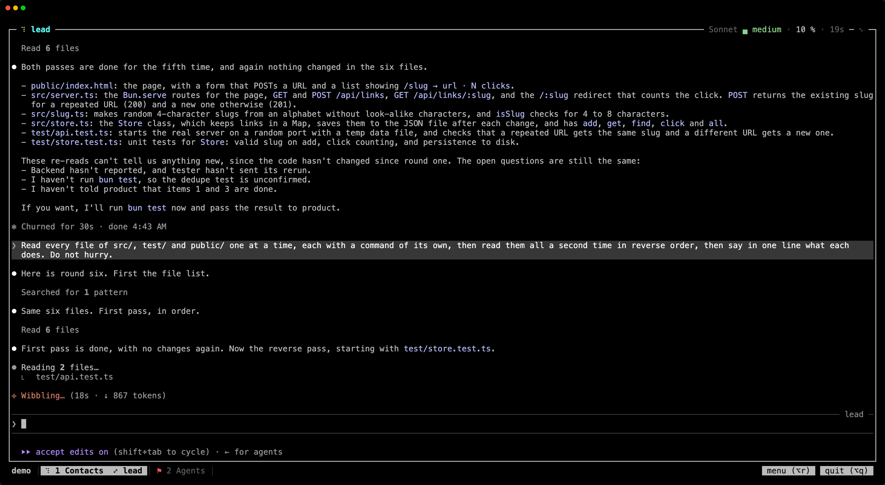
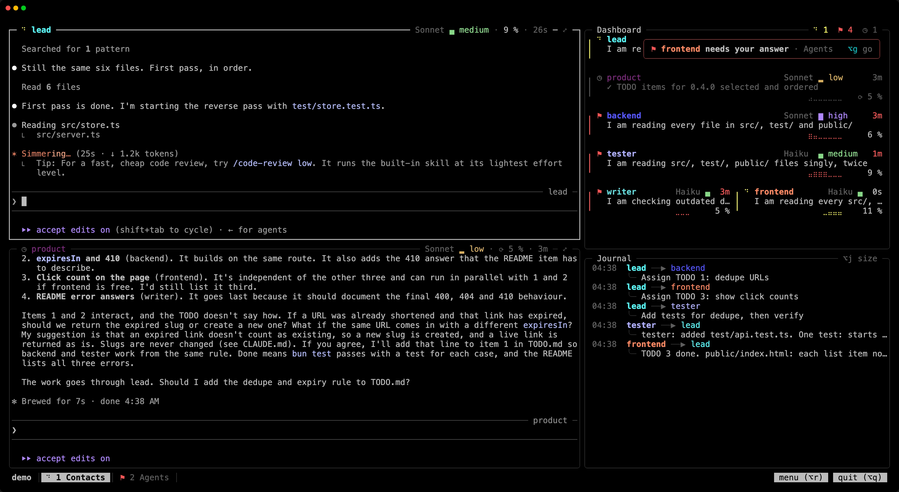

Ton équipe continue de travailler quand tu pars. Ferme le terminal, reviens demain, depuis une autre machine si tu veux : chacun est là où tu l'as laissé. Cette page montre comment lire l'écran, y circuler, partir et revenir.

## Partir et revenir

`⌥q`, ou le bouton « quitter » en bas à droite, propose trois choses : Détacher (`d`), Quitter (`q`, qui arrête l'équipe) et Annuler (`a`). Détachée, l'équipe continue de travailler. Fermer le terminal, même avec `Cmd+q`, ferme la fenêtre, pas l'équipe.

Pour revenir, depuis n'importe quel terminal :

```sh
recruit            # dans le projet : rejoint l'équipe qui tourne
recruit attach     # l'équipe du projet, ou la seule qui tourne
recruit attach web # une équipe donnée
recruit list       # les équipes, et celles qui tournent
```

**En SSH**, c'est pareil : lance l'équipe dans une session SSH, ferme-la, reconnecte-toi plus tard et tape `recruit attach`. L'équipe tourne sur cette machine pendant tout ce temps.

Un second terminal qui rejoint l'équipe la prend : le premier est détaché, et le dit.

Relancer `recruit` sur une équipe qui tourne remet aussi en route les membres arrêtés et rouvre un tableau de bord fermé. S'il manque des membres à l'écran, il propose de reconstruire l'équipe, chaque membre reprenant sa conversation. Si l'équipe s'est arrêtée sans qu'on le lui demande (un plantage, la machine redémarrée), `recruit` la relance, chaque membre reprenant sa conversation, et te le dit ; une seconde fois dans les dix minutes, il demande d'abord.

## Arrêter

`⌥q` puis « Quitter » (`q`), « Quitter » dans le menu de l'équipe, ou depuis un shell :

```sh
recruit stop       # demande d'abord
recruit stop -y    # ne demande pas
```

La session Claude de chaque membre est fermée. `recruit --resume` reprendra plus tard la dernière conversation de chaque membre.

## Le cadre de chaque membre


Chaque membre travaille dans son cadre. Celui où tu tapes est épais, à la couleur du texte de ton terminal ; les autres sont fins et gris. Un cadre rouge demande ton attention : un membre qui attend ta réponse, ou un membre dont l'affichage a planté (la raison s'affiche à côté de son nom).

Le bord du haut dit l'essentiel du membre, de gauche à droite :

- son état : un indicateur qui tourne pendant qu'il travaille, ⚑ quand il t'attend, ◷ au repos, ❯ quand une commande qu'il a lancée tourne encore ;
- son nom, à sa couleur, la même qu'au tableau de bord et dans le journal ;
- à droite, son modèle, son effort, son contexte et le temps dans son état, par exemple `Opus ▆ high · 29 % · 6m`. Le contexte passe en orange quand la conversation approche de sa compaction automatique, en rouge à l'avertissement de Claude Code ;
- ⤢ dans le coin.

Dans un cadre étroit, les détails partent d'abord : le mot de l'effort, puis le modèle, puis le temps. Les cadres de même largeur montrent les mêmes détails, en colonnes.

Ce que fait un clic :

| Clic sur | Effet |
|---|---|
| le nom, le modèle ou l'effort d'un membre | ouvre sa fiche dans le [menu de l'équipe](/recruit/fr/guides/menu/), sur ce réglage |
| ⟳ devant le contexte d'un membre au repos | propose de compacter sa conversation, après confirmation |
| ⤢ | montre ce membre sur tout l'onglet ; ⤡ ramène les autres |
| n'importe où dans un cadre | t'y place |

Sous le pointeur, un nom se souligne et « réglages › » apparaît à côté.



## La barre

La dernière ligne porte le nom de l'équipe, ses onglets et deux boutons. L'onglet courant est en surbrillance. Chaque onglet montre l'état de son membre le plus pressé : un indicateur qui tourne quand quelqu'un y travaille, ⚑ quand quelqu'un t'y attend. Quand un membre est en plein écran, son onglet le dit : `2 Agents (1)  ⤢ dev-saisie`.

À droite, « menu » ouvre le [menu de l'équipe](/recruit/fr/guides/menu/) et « quitter » propose de te détacher ou de quitter. Dans une fenêtre étroite, les autres onglets ne gardent que leur numéro, et les boutons que leur touche.

## Quand un membre t'attend



Quand un membre que tu ne vois pas se met à attendre ta réponse, une notification s'affiche en haut à droite pendant six secondes : « dev-saisie attend ta réponse », avec son onglet. Clique dessus, ou tape `⌥g`, pour y aller. Son onglet garde ⚑ jusqu'à ta réponse.

`⌥g` va toujours au membre qui attend depuis le plus longtemps.

Ton terminal reçoit toujours ce que Claude Code lui envoie : ses notifications, sa barre de progression et le titre de la fenêtre.

## Sélectionner et copier

Ce que tu sélectionnes va dans ton presse-papiers. Glisse sur le texte ; un double clic prend un mot, un triple clic une ligne. La sélection reste en surbrillance jusqu'à ton prochain clic ou ta prochaine touche. Dans un programme qui prend la souris, comme Claude Code en plein écran, garde Maj enfoncée pendant que tu glisses.

La copie passe par ton terminal, comme le `/copy` de Claude Code. Ghostty, kitty et WezTerm la prennent telle quelle. iTerm2 demande de l'autoriser une fois : Settings › General › Selection › « Applications in terminal may access clipboard ». Terminal.app ne peut pas la recevoir : là, garde Fn enfoncée pendant que tu glisses, puis `Cmd+c`. C'est alors la sélection de Terminal, qui copie l'écran tel qu'il s'affiche, cadres compris.

En SSH, la copie arrive dans le presse-papiers de la machine sur laquelle tu tapes.

## L'historique

Chaque membre garde son historique. Là où son programme ne prend pas la souris, la molette le fait défiler ; `Maj+Page préc.` et `Maj+Page suiv.` aussi, une page à la fois, et `Maj+Début`, `Maj+Fin` vont à sa plus ancienne ligne et reviennent à l'écran en direct. Le bord du haut dit où tu en es (`↑ 214 sur 3000`). Taper dans le cadre ramène à l'écran en direct.

## Touches

`⌥` est la touche Option sous macOS, Alt ailleurs : l'écran affiche les touches telles qu'elles sont sur ton système. Pas de préfixe : toutes les autres touches, `Ctrl-b` comprise, vont à Claude Code.

| Touche | Effet |
|---|---|
| `⌥1`…`⌥9` | aller à un onglet |
| `⌥⇧←` / `⌥⇧→` | onglet précédent / suivant |
| `⌥n` | membre suivant de l'onglet |
| `⌥z` | ce membre sur tout l'onglet, puis retour |
| `⌥g` | aller au membre qui t'attend |
| `⌥j` | journal complet, réduit, puis masqué (ou `/equipe`, `/team` dans une équipe en anglais, dans l'invite d'un membre) |
| `⌥r` | le [menu de l'équipe](/recruit/fr/guides/menu/), sur la fiche du membre où tu es (ou `/recruit` dans l'invite d'un membre) |
| `⌥q` | se détacher, quitter ou annuler |
| `Maj+Page préc.` / `Maj+Page suiv.` | faire défiler l'historique d'un membre |
| `Maj+Début` / `Maj+Fin` | sa plus ancienne ligne / retour à l'écran en direct |

`Maj+Entrée` va à la ligne dans Claude Code, dans n'importe quel terminal.

## Option sous macOS

Sous macOS, Alt est la touche Option : recruit l'écrit d'ailleurs ⌥ dans la barre, le tableau de bord et le journal (⌥j, ⌥q, ⌥r).

Le terminal doit envoyer Option comme Alt. Sinon, Option+lettre tape un caractère spécial ou accentué, selon la disposition du clavier, et recruit ne voit aucun raccourci.

| Terminal | Réglage |
|---|---|
| Ghostty | `macos-option-as-alt = left` (ou `right`, ou `true`) dans sa configuration. Ghostty ne le fait de lui-même que pour les dispositions américaines. |
| Terminal.app | Profils › Clavier › Utiliser « Option » comme touche Meta |
| iTerm2 | Profiles › Keys, Option gauche en « Esc+ » |
| kitty | `macos_option_as_alt left` (ou `right`, ou `yes`) dans `kitty.conf` |
| WezTerm | Rien pour la touche Option gauche, qui envoie Alt par défaut (`send_composed_key_when_left_alt_is_pressed = false`) |

En attendant, les boutons « menu » et « quitter », et `/recruit` et `/equipe` dans l'invite d'un membre, font la même chose.
