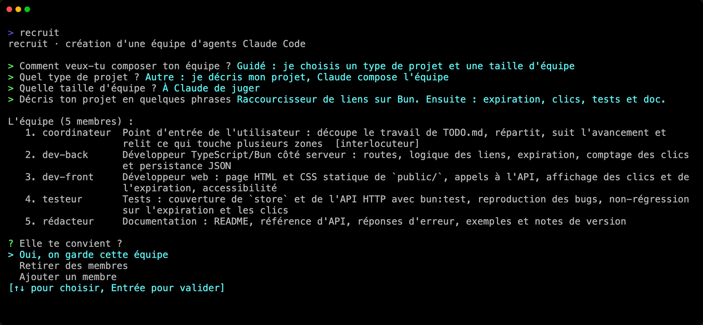

Ton équipe, c'est le groupe de spécialistes avec qui tu travailles : qui ils sont, ce dont chacun s'occupe, comment ils travaillent ensemble. Tu la composes une fois. Ensuite, elle est là chaque fois que tu reviens, et elle grandit avec le projet.

Une équipe peut appartenir à un projet, partagée avec tous ceux qui y travaillent, ou à toi, prête pour n'importe quel dossier. Dans les deux cas, c'est un petit fichier que tu peux lire et modifier.

## Équipes locales

Une équipe locale appartient à un projet. Elle est dans `.recruit/settings.toml`, à la racine du projet, et se commite : tous ceux qui clonent le projet ont la même équipe.

- `recruit` la trouve depuis n'importe quel sous-dossier du projet.
- Les membres travaillent à la racine du projet, d'où que tu la lances.
- Un fichier peut contenir plusieurs équipes. `recruit` seul lance la seule, ou celle que nomme `default` en tête du fichier ; sinon, il demande laquelle.

## Réglages personnels

`.recruit/settings.local.toml`, à côté, contient tes réglages à toi pour le projet. Quand recruit enregistre une équipe dans le projet, il écrit un `.recruit/.gitignore` qui tient ce fichier hors de git ; si tu as écrit l'équipe à la main, ajoute toi-même `settings.local.toml` à `.recruit/.gitignore`.

Il est fusionné clé par clé avec `settings.toml`, et il prime : une table se fusionne avec la table du même nom, toute autre valeur (un texte, un nombre, une liste) remplace celle de `settings.toml`. Un réglage écrit là ne change l'équipe que pour toi :

```toml title=".recruit/settings.local.toml"
[claude]
config_dir = "~/.claude-perso"    # ton profil Claude Code

[teams.web.members.dev-back]
model = "sonnet"                  # ce membre, sur ta machine seulement
```

`recruit edit --local` l'ouvre, et le crée au besoin.

## Équipes globales

Une équipe globale t'appartient plutôt qu'à un projet. Elle est dans `~/.config/recruit/<équipe>.toml` (dans `$XDG_CONFIG_HOME/recruit/` si cette variable est définie), et se lance de n'importe où :

```sh
cd ~/un/projet
recruit mon-equipe
```

Une équipe globale n'a pas de dossier à elle : elle travaille dans le dossier où tu la lances. Locale et globale ne diffèrent que par l'endroit d'où on peut les lancer.

## Quelle équipe lance `recruit`

| Tu tapes | recruit… |
|---|---|
| `recruit` dans un projet qui a une équipe | la lance (celle de `default`, ou demande laquelle si le projet en a plusieurs) |
| `recruit` ailleurs, avec des équipes globales | les propose, et n'en lance jamais une sans demander ; il peut aussi créer une nouvelle équipe |
| `recruit` sans aucune équipe | en crée une en mode interactif |
| `recruit <équipe>` | lance cette équipe : la locale si une équipe locale et une globale portent ce nom, sinon la globale |
| `recruit <équipe>`, inconnue | la crée en mode interactif, sous ce nom |

Une équipe ne tourne qu'à un endroit à la fois : la relancer depuis le même dossier la rejoint, depuis un autre dossier est refusé.

## Composer une équipe

`recruit new`, ou `recruit` seul sans équipe, demande comment la composer :

- **Guidé** : tu choisis un type de projet et une taille, et tu obtiens une [équipe intégrée](/recruit/fr/reference/templates/) : 3, 5 ou 8 membres avec leurs rôles et leurs instructions.
- **Claude compose l'équipe** : en mode guidé, choisis « Autre : je décris mon projet, Claude compose l'équipe », puis une taille ou « À Claude de juger », et décris ton projet en quelques phrases. Claude lit le projet et compose une équipe par métier : un rôle intégré quand il convient, sinon un métier et une spécialité, comme `dev-rust`, et jamais deux membres sur la même zone.
- **Manuel** : tu donnes le nom, le rôle et, si tu veux, les instructions de chaque membre. recruit propose ensuite d'ajouter ses règles communes (point d'entrée, zones, dépôt git partagé…).



Ensuite, quelle que soit la façon :

1. **L'équipe** : la garder, retirer des membres, ou en ajouter un.
2. **Tes interlocuteurs** : les membres à qui tu parles, deux au plus ; les autres sont des agents de travail. Si tu n'en coches aucun, c'est le premier membre. Voir [Interlocuteurs et agents de travail](/recruit/fr/guides/contacts-and-agents/).
3. **Les permissions des agents** : le réglage habituel de Claude Code, `acceptEdits` (modifications de fichiers acceptées d'office), `auto` (Claude Code approuve seul ce qui est sans risque) ou `bypassPermissions` (aucune demande).
4. **Le nom** de l'équipe.
5. **Où l'enregistrer** : dans le projet (`.recruit/settings.toml`, à commiter) ou dans ton profil (`~/.config/recruit/<équipe>.toml`).
6. **La lancer maintenant**, ou plus tard.

### Sans aucune question

La même chose, depuis un script ou en une ligne :

```sh
recruit new web --template web --size medium                            # une équipe intégrée
recruit new web --describe "Boutique en Next.js avec une API en Go"     # composée par Claude
recruit new web -m "pilote:Coordonne" -m "dev:Écrit le code"            # membre par membre
```

`-m` marche aussi avec `--template`, pour ajouter un membre à l'équipe intégrée ou donner un autre rôle à l'un de ses membres. `--contact`, `--model`, `--permission-mode`, `--global` et `--launch` les complètent : voir [`recruit new`](/recruit/fr/reference/commands/#recruit-new).

## Noms

Les noms d'équipe et de membre suivent les mêmes règles, que recruit te les demande ou que tu les écrives dans le fichier :

- **Le nom d'une équipe** devient un nom de fichier : lettres (accents compris) et chiffres, `-` et `_`, 40 caractères au plus, sans `-` au début. Ce ne peut pas être une commande de recruit : `new`, `list`, `attach`, `stop`, `edit`, `templates`, `help`, ni les commandes internes qui commencent par `_`.
- **Le nom d'un membre** est l'adresse à laquelle lui écrivent ses coéquipiers : lettres et chiffres, `-`, `_` et `.`, sans espace, 40 caractères au plus, sans `-` ni `.` au début. Deux membres d'une équipe ne peuvent pas porter des noms qui ne diffèrent que par la casse.

Un nom écrit à la main qui ne suit pas ces règles empêche l'équipe de se lancer : recruit nomme le fichier, le nom et la raison (voir [la FAQ](/recruit/fr/faq/#-ne-peut-pas-porter-ce-nom-)). Le menu de l'équipe refuse aussi un nom que porte déjà une session Claude ouverte dans le dossier de l'équipe.

## Modifier une équipe

- **Pendant qu'elle tourne** : le [menu de l'équipe](/recruit/fr/guides/menu/) (`Alt+r`) change le modèle, l'effort, le rôle, les instructions, l'onglet ou le mode de permission d'un membre, ajoute et retire des membres, et écrit le changement dans le bon fichier. La plupart des changements arrivent tout de suite à l'équipe lancée.
- **À la main** : `recruit edit` ouvre le `settings.toml` du projet dans ton éditeur (`$VISUAL`, sinon `$EDITOR`, sinon `vi`), `recruit edit <équipe>` le fichier d'une équipe donnée, `recruit edit --local` ton fichier personnel. recruit vérifie que le fichier se lit toujours quand tu le fermes.

Ce que fait une équipe lancée des changements faits à la main :

| Changement | S'applique |
|---|---|
| Rôles, instructions, les membres de l'équipe tels que les décrivent les prompts | avec le prochain message de chaque membre, avec [le mod de recruit](/recruit/fr/guides/claude-code/#le-mod-de-recruit) |
| Le modèle, l'effort, le mode de permission, les arguments d'un membre | au prochain démarrage de ce membre |
| Un membre ajouté ou retiré | au lancement suivant, ou dès que tu changes quoi que ce soit dans le menu de l'équipe |
| Disposition, onglets, grille, tableau de bord, langue | au lancement suivant |

`recruit --restart --resume` applique tout tout de suite, chaque membre reprenant sa conversation.

Chaque clé est décrite dans la [référence de la configuration](/recruit/fr/reference/configuration/).
