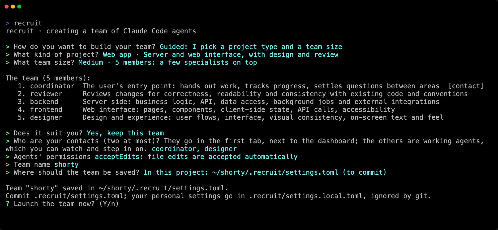
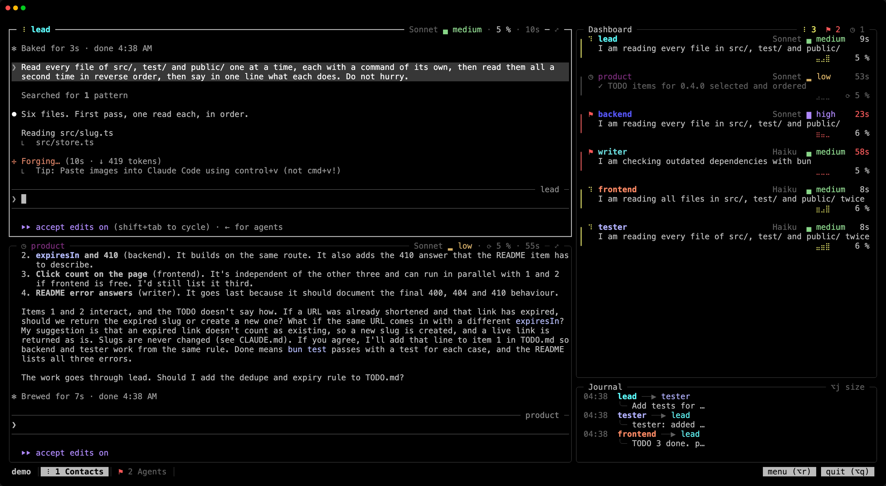

Two minutes from now, you have a team for your project and have given it its first job.

## 1. Create a team

In your project, run `recruit`. When the project has no team yet, recruit offers to create one:

```
$ cd my-project
$ recruit
recruit · creating a team of Claude Code agents

> How do you want to build your team? Guided: I pick a project type and a team size
> What kind of project? Personal project · A personal tool or site: little ceremony, just the code and the interface
> What team size? Small · 3 members: the essentials

The team (3 members):
   1. coordinator  The user's entry point: hands out work, tracks progress, settles questions between areas  [contact]
   2. developer    Development: writes and evolves the project's code, outside areas owned by other members
   3. designer     Design and experience: user flows, interface, visual consistency, on-screen text and feel
…
```



The questions that follow the list let you remove or add members, pick your contacts (the members you talk to), the agents' permissions, the team's name, and where to save it: in the project, to commit, or in your profile, to launch it from anywhere. [Teams](/recruit/guides/teams/) explains each choice.

Prefer a single command? This one creates the same kind of team without a question and launches it:

```sh
recruit new my-team --template personal --size small --launch
```

## 2. Launch it

```sh
recruit
```

In a project that has a team, `recruit` launches it. The team opens in your terminal: your contacts in the first tab, the dashboard and the journal on their right, the working agents in the next tabs.

:::tip[Approve the folder once]
Claude Code asks every new session whether to trust a folder it has never approved, and Enter alone answers "No, exit". recruit warns you before launching. To approve the folder once for the whole team, run `claude` there first and accept.
:::



## 3. Talk to your contacts

Type your request to the coordinator, in the first tab, as you would to Claude Code. It breaks the work down and hands it out to the working agents, which report back to it. The dashboard shows who works, who rests and who waits for you; the journal below it, the messages they send each other.

To watch an agent, click its card on the dashboard, or go to its tab with `Alt+1`…`Alt+9`. You can type in its pane too: it does what you ask and keeps the contacts informed.

## 4. Leave and come back

`Alt+q` (`⌥q` on macOS), or the "quit" button at the bottom right, offers to detach (`d`) or to quit, which stops the team (`q`). Detached, the team keeps working, even when you close the terminal:

```sh
recruit          # back where you left it, from any terminal, even over SSH
recruit stop     # closes every member's session
```

## Next

- [Teams](/recruit/guides/teams/): local or global, personal settings, the ways to compose a team.
- [The team's menu](/recruit/guides/menu/): change a member's model, role or tab while the team runs.
- [Around the screen](/recruit/guides/screen/): leave and come back, follow a member full screen, keys, and Option on macOS.
- [Configuration](/recruit/reference/configuration/): every key of the team's file.
