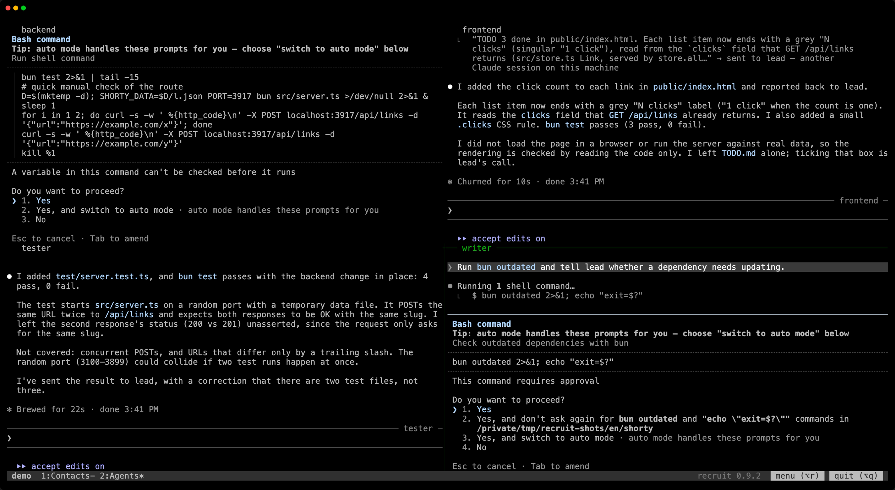

You don't manage every agent yourself. You talk to one or two members, your contacts. They hand the work out to the others, and tell you how it goes. The others, the working agents, each take care of their own area. You can still watch any of them, and step in when you want to.

Behind the scenes, each member is a Claude Code session with its own name and role, and writes to its teammates with `SendMessage`.

## Contacts

Your **contacts** are the members you talk to: the coordinator, for instance. They sit in the first tab. A team has one or two:

```toml
[teams.web.members.coordinator]
role = "The user's entry point: hands out work, tracks progress"
contact = true
```

When no member has `contact = true`, the first member is the contact. The first contact is the **main contact**: it alone keeps the whole bottom of Claude Code, your status line included (see [The bottom of Claude Code](/recruit/guides/claude-code/#the-bottom-of-claude-code)).

## Working agents

The other members are **working agents**. They get their work from the contacts and report back to them, without waiting on you: their prompt tells them to ask the contacts when they are stuck rather than wait in their terminal.

Every agent keeps a pane you can see. Watch any of them, and type in its pane when you need to step in: the agent does what you ask, then keeps the contacts informed.

## Tabs

With the default layout, `layout = "auto"`:

- **The first tab**, "Contacts", holds your contacts, one above the other, and on their right the [dashboard over the journal](/recruit/guides/dashboard/). With `dashboard = false`, the contacts sit side by side.
- **The working agents** come next, grouped by their `tab`, or in "Agents" when they have none.
- **A group larger than a tab** (`columns × rows`, 3 × 2 = 6 by default) is split evenly: "Agents (1)", "Agents (2)"… For example, 8 agents give 4 + 4, and 7 give 4 + 3. A `tab` group that is too large is split the same way: "Code (1)", "Code (2)"…
- **Each tab is a grid**: as few rows as possible, then as few columns as these rows need. With 3 columns: 2 panes side by side, 4 in 2 × 2, 5 in 3 + 2, 6 in 3 × 2.

In a French team, the first tab is called "Interlocuteurs". A member's `tab` can be any title but recruit's own, in either language: "Contacts", "Interlocuteurs", "Agents (1)", "Agents (2)"… "Agents" alone is the default group.



```toml
[teams.web]
columns = 3            # at most 3 columns…
rows = 2               # …and 2 rows in a tab

[teams.web.members.backend]
role = "Server and API"
tab = "Code"           # shares the "Code" tab with the other agents that have it

[teams.web.members.frontend]
role = "Web interface"
tab = "Code"
```

### One tab per member

`layout = "tabs"` gives each member a tab of its own, named after it, contacts first. The dashboard and the journal go in the first tab.

## Changing it while the team runs

The [team's menu](/recruit/guides/menu/) makes a member a contact or a working agent, or moves it to another tab. Its pane moves without its Claude stopping. When the only contact leaves or becomes a working agent, the menu asks who takes its place.

## Moving between tabs

`Alt+1`…`Alt+9` go to a tab, `Alt+Shift+←` / `Alt+Shift+→` to the previous or next one, and a click on a member's card on the dashboard goes to its pane. See [In tmux](/recruit/guides/tmux/).
