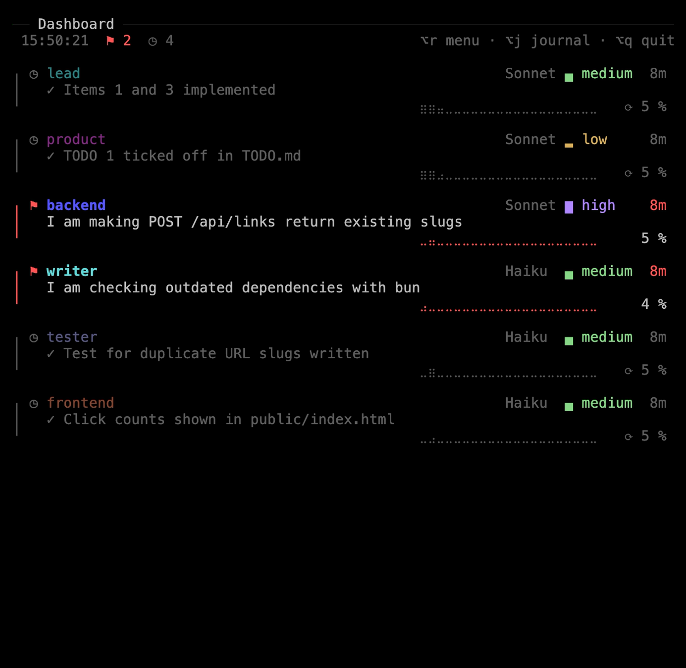
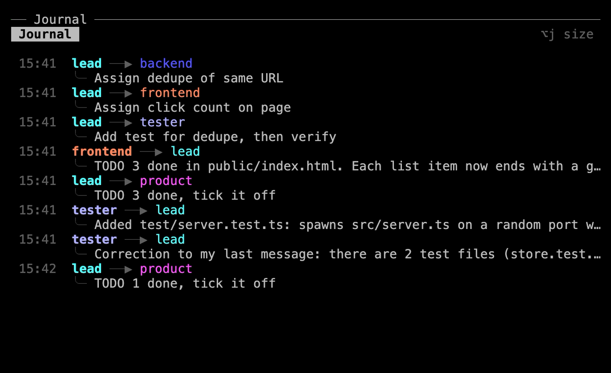

The dashboard tells you at a glance who is working, on what, and who is waiting for you. The journal shows what the members tell each other. You know where things stand without asking anyone.

Both sit on the right of your contacts, in the first tab: the **dashboard** on top, the **journal** below. They read what Claude Code already records, its list of sessions (`claude agents --json`) and the conversation files.

## The dashboard

At the top: the time, how many members are in each state, and the shortcuts. In a narrow pane, the time goes first, then the shortcuts. Then a card per member.

### A card

A line on the card's left takes the color of the member's state, and the name says it too:

| State | Line | Name |
|---|---|---|
| At work | bright yellow | bold, with a spinner on its left |
| Waiting for you in its terminal (a permission, a question) | bright red | bold, with the state's icon on its left, and the time in red |
| At rest | grey | dimmed, with the state's icon on its left |

The card also shows for how long the member has been in that state (12s, 22m, 1h05), a curve of its activity over the last half hour, and, in its title, its model and its effort, as far as the room allows: "Opus █ xhigh", else "Opus █", else "Opus". The model is always dimmed. The effort is always bright, in Claude Code's colors (low yellow, medium green, high and xhigh purple, max rainbow), with its level sign. Without the mod, these are the ones the team's file sets, when it sets them.

With [recruit's mod](/recruit/guides/claude-code/#recruits-mod), loaded with Claude Code 2.1.287 or newer, the cards show more:

- **The model and the effort** the member's session actually uses.
- **The context**, which turns orange at 80% of the point where Claude Code compacts the member's conversation on its own, and red at its warning, 20,000 tokens before that point.
- **What it does**: a line that sums up the member's current request, the one you typed to it or a teammate's message. Too long, it goes over two lines when there is room, and is cut otherwise. At rest, the line shows the last task, in its finished form ("✓ Version 2.4.1 released"). A message that asks for nothing (thanks, an agreement) keeps the line from before.
- **The usage** of your account at the bottom: 5 hours and 7 days, with the time left before each resets.

:::note[What the summaries cost]
Haiku writes both forms of the line in the same call, once per new request, through the member's session and so on your account: the request read up to 2,000 characters, two lines back.
:::

### Compacting a conversation

A click on the context of a member at rest, marked ⟳, offers to compact its conversation, once you confirm. It is what Claude Code would do on its own at the threshold, and costs as much: the member's model rereads its whole context to sum it up. A member that went back to work meanwhile refuses. Until the member's next answer, the card then shows the context as Claude Code counts it, like `/context`.

### Order and room

The cards come in this order: the contacts, the agents waiting for you, those at work, then those at rest, the most recent first. In that order, each card takes the richest form the room leaves it, once the cards after it have their plainest one:

- across the whole pane, with what it does on two lines, or on one;
- side by side with another card, with one line or none;
- for a working agent at rest, only its name, in a list below the cards.

The agents at work keep the whole width and their whole task as long as the others can make room: those at rest longest go into the list first, and the list comes down to one line ("… and 3 more") before an agent at work loses any of its task. The layout changes only when the cards, their states or the pane change.

When sessions open elsewhere use members' names, a dimmed line over the usage names them, if room is left.

## The journal

The journal lists the messages the members send each other, two lines each.

It has three sizes: full (half of the column), reduced (its last three messages, the rest of the column to the dashboard) and hidden. It starts reduced. `Alt+j` (`⌥j` on macOS) takes it from full to reduced, then to hidden, then back to full. `/team` (`/equipe` in a French team), typed in a member's prompt, does the same, even while Claude works.

## Clicks

A click on a member's card, on its name in the list, or on the sender or the recipient of a message in the journal, goes to that member's pane, in its tab.

## Without them

`dashboard = false` in the team's settings, or "Dashboard" in the [team's menu](/recruit/guides/menu/), leaves both out: the contacts then sit side by side in the first tab. With `layout = "tabs"`, both go in the first tab.

A dashboard closed by mistake comes back when you run `recruit` again on the running team.
