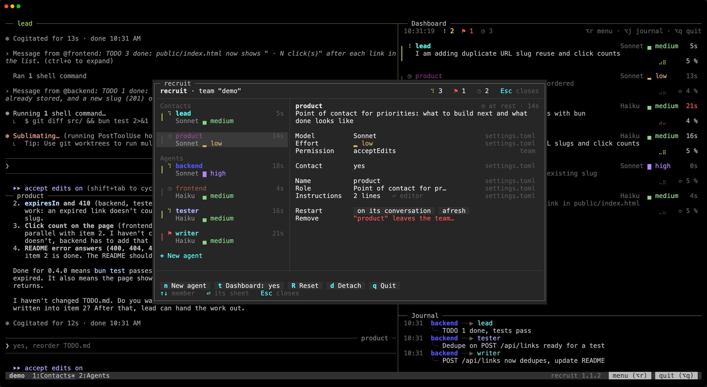

Your team changes with the project. Give a member a stronger model, rewrite a role, bring in a specialist, let someone go: the menu does it without stopping the team.

Every change is saved in the team's files, and most reach the running team at once.

## Opening it

- `Alt+r` (`⌥r` on macOS) in any pane of the team;
- the "menu" button on the right of the status line;
- `/recruit`, typed in a member's prompt, with [recruit's mod](/recruit/guides/claude-code/#recruits-mod).

The menu opens in a tmux popup over the team. It needs a window of 50 × 14 at least.

## The screen

- **On the left**, the members as on the dashboard (the line and the icon of their state, their name, the time in that state, their model dimmed and their effort in color), contacts first, then the working agents, and "+ New agent" below.
- **On the right**, the chosen member's sheet: one setting per row, and on the right of each, dimmed, where its value comes from. Below the sheet, a line says what "default" gives and when a change takes effect.
- **At the bottom**, the result of the last change, then the team's actions, each with its key.

Everything can be clicked. In a narrow window, the list keeps only the names, and the origins go under the sheet.

## Keys

| Key | In the list | In a sheet |
|---|---|---|
| `↑` `↓` | choose a member | choose a setting |
| `⏎` | open its sheet (`→` and `Tab` too) | open the list of values, or edit the text in place |
| `←` `→` | | change the value in place |
| `Esc` | close the menu | give up a value prepared or a new agent being composed, then back to the list |

- **The list of values** starts with "default: …", what the setting gives when the member does not set it, and marks the current value.
- **Text** (the name, the role) is edited in place; the instructions open in your editor. Mistakes are pointed out as you type.
- **`←` `→`** apply a model or an effort at once when the member's requests can carry it. Otherwise the value is only prepared, marked "to apply ⏎", and `⏎` applies it.
- **Confirmations** open in the middle, on "Cancel".

## A member's sheet

| Setting | What it does |
|---|---|
| Model, Effort | the member's Claude model and effort |
| Permission | its Claude Code permission mode |
| Contact | whether you talk to it, or it is a working agent |
| Tab | the tab it shares with other working agents |
| Name, Role, Instructions | who it is, as its teammates and its prompt see it |
| Restart | start it again, on its conversation or afresh |
| Remove | take it out of the team, and close its pane |

## The team's actions

| Key | Action |
|---|---|
| `n` | New agent: a built-in role, one Claude composes from your request, or one you write. "⏎ Add and launch" gives it a pane at once. |
| `t` | Dashboard: the dashboard and the journal, on or off |
| `R` | Reset: every member on a new conversation, their contexts emptied (asks "Reset the team?") |
| `d` | Detach: leave the team running |
| `q` | Quit: stop the team, every member's session closed (asks "Quit the team?") |

These keys work from the list of members; in a sheet, a letter does nothing. A click works everywhere.

## Where changes are written

recruit writes each change into the file that gives the value now, comments kept:

- for a global team, its own file;
- for a local team, `.recruit/settings.local.toml` when it has the setting, else `.recruit/settings.toml` when it has it, else the file that defines the member or the team, `settings.toml` first.

Picking "default" takes the setting out of that file, and a table left empty with it. Renaming or removing a member changes every file that defines it; a new member goes into the file that defines the team. Nothing is written in Claude Code's settings.

## When changes take effect

- **At once**: a new agent gets its pane, a removed one loses it, and panes move between tabs without their Claude stopping.
- **From the next request**, with the mod: a new model or effort.
- **With the next message**, with the mod: a new role, new instructions or new teammates reach each member in a note joined to its next message, without starting a turn.
- **After a restart on its conversation**: a renamed member, a new permission mode, or a model or an effort its requests cannot carry (going back to Claude Code's default, for instance). When the main contact changes and your settings give a status line, the former and the new main contact restart too, so that the status line follows.

The menu asks first when a member it would restart is at work, waiting for a permission, or in a state it cannot see.

## Safeguards

- The last member cannot be removed.
- When the only contact leaves or becomes a working agent, the menu asks who takes its place.
- A name that differs from a teammate's only by case is refused, and so is the name of a session already open in the team's folder.
- A tab cannot take the name of one of recruit's tabs ("Contacts", "Agents (2)"…).

When the team's files do not read (a typo made by hand, for instance), the menu still opens, read-only: the members as launched, the error, and only detach and quit.
