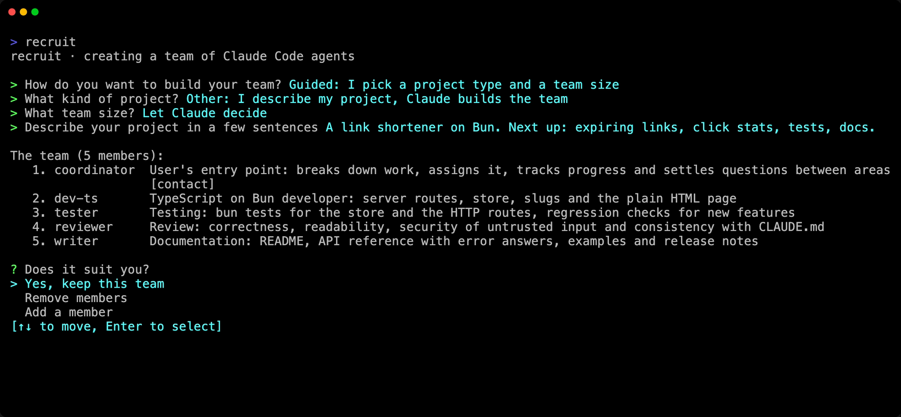

Your team is the group of specialists you work with: who they are, what each one owns, how they work together. You put it together once. Then it is there every time you come back, and grows with the project.

A team can belong to a project, shared with everyone who works on it, or to you, ready for any folder. Either way, it is a short file you can read and edit.

## Local teams

A local team belongs to a project. It lives in `.recruit/settings.toml`, at the root of the project, and is meant to be committed: everyone who clones the project gets the same team.

- `recruit` finds it from any subdirectory of the project.
- The members work at the project's root, wherever you launch it from.
- A file can hold several teams. A bare `recruit` launches the only one, or the one named by `default` at the top of the file; otherwise it asks which.

## Personal settings

`.recruit/settings.local.toml`, next to it, holds your own settings for the project. When recruit saves a team in the project, it writes a `.recruit/.gitignore` that keeps this file out of git; if you wrote the team by hand, add `settings.local.toml` to `.recruit/.gitignore` yourself.

It is merged over `settings.toml` key by key, and takes precedence: a table merges with the table of the same name, any other value (a string, a number, a list) replaces the one in `settings.toml`. A setting written there changes the team for you alone:

```toml title=".recruit/settings.local.toml"
[claude]
config_dir = "~/.claude-work"     # your Claude Code profile

[teams.web.members.backend]
model = "sonnet"                  # this member, on your machine only
```

`recruit edit --local` opens it, and creates it when needed.

## Global teams

A global team belongs to you rather than to a project. It lives in `~/.config/recruit/<team>.toml` (in `$XDG_CONFIG_HOME/recruit/` when that variable is set), and can be launched from anywhere:

```sh
cd ~/some/project
recruit my-team
```

A global team has no folder of its own: it works in the directory where you launch it. Local and global teams differ only by where you can launch them from.

## Which team `recruit` launches

| You type | recruit… |
|---|---|
| `recruit` in a project with a team | launches it (the `default` one, or asks when the project has several) |
| `recruit` elsewhere, with global teams | offers them, and never launches one without asking; it can also create a new team |
| `recruit` with no team at all | creates one interactively |
| `recruit <team>` | launches that team: the local one when both a local and a global team have that name, otherwise the global one |
| `recruit <team>`, unknown | creates it interactively, with that name |

A team runs in one place at a time: launching it again from the same folder joins it, and from another folder is refused.

## Composing a team

`recruit new`, or a bare `recruit` with no team, asks how to build it:

- **Guided**: you pick a project type and a size, and get a [built-in team](/recruit/reference/templates/): 3, 5 or 8 members with their roles and instructions.
- **Claude composes the team**: in the guided mode, pick "Other: I describe my project, Claude builds the team", then a size or "Let Claude decide", and describe your project in a few sentences. Claude reads the project and composes a team by trade: a built-in role when one fits, otherwise a trade and a specialty, such as `dev-rust`, and never two members on the same area.
- **Manual**: you give each member's name, role and, optionally, its instructions. recruit then offers to add its shared rules (point of contact, areas, shared git repository…).



Then, whatever the way:

1. **The team**: keep it, remove members, or add one.
2. **Your contacts**: the members you talk to, two at most; the others are working agents. With none ticked, the first member is the contact. See [Contacts and working agents](/recruit/guides/contacts-and-agents/).
3. **The agents' permissions**: Claude Code's usual setting, `acceptEdits` (file edits accepted), `auto` (Claude Code approves safe actions on its own) or `bypassPermissions` (never asks).
4. **The name** of the team.
5. **Where to save it**: in the project (`.recruit/settings.toml`, to commit) or in your profile (`~/.config/recruit/<team>.toml`).
6. **Launch it now**, or later.

### Without a question

The same, from a script or a single line:

```sh
recruit new web --template web --size medium                    # a built-in team
recruit new web --describe "Shop in Next.js with a Go API"       # composed by Claude
recruit new web -m "lead:Coordinates" -m "dev:Writes the code"   # member by member
```

`-m` also works with `--template`, to add a member to the built-in team or give one of its members another role. `--contact`, `--model`, `--permission-mode`, `--global` and `--launch` complete them: see [`recruit new`](/recruit/reference/commands/#recruit-new).

## Names

Team and member names follow the same rules, whether recruit asks for them or you write them in the file:

- **A team's name** becomes a file name: letters (accents included) and digits, `-` and `_`, 40 characters at most, not starting with `-`. It cannot be one of recruit's commands: `new`, `list`, `attach`, `stop`, `edit`, `templates`, `help`, or the internal ones that start with `_`.
- **A member's name** is the address its teammates write to: letters and digits, `-`, `_` and `.`, no spaces, 40 characters at most, not starting with `-` or `.`. Two members of a team cannot have names that differ only by case.

A name written by hand that breaks these rules stops the team from launching: recruit names the file, the name and the reason (see [the FAQ](/recruit/faq/#cannot-have-this-name)). The team's menu also refuses a name that a Claude session open in the team's folder already has.

## Changing a team

- **While it runs**: the [team's menu](/recruit/guides/menu/) (`Alt+r`) changes a member's model, effort, role, instructions, tab or permission mode, adds and removes members, and writes the change into the right file. Most changes reach the running team at once.
- **By hand**: `recruit edit` opens the project's `settings.toml` in your editor (`$VISUAL`, else `$EDITOR`, else `vi`), `recruit edit <team>` a given team's file, `recruit edit --local` your personal file. recruit checks that the file still reads when you close it.

What a running team does with changes made by hand:

| Change | Applies |
|---|---|
| Roles, instructions, the team's members as the prompts describe them | with each member's next message, with [recruit's mod](/recruit/guides/claude-code/#recruits-mod) |
| A member's model, effort, permission mode, arguments | when that member next starts |
| A member added or removed | at the next launch, or as soon as you change anything in the team's menu |
| Layout, tabs, grid, dashboard, language | at the next launch |

`recruit --restart --resume` applies everything at once, each member resuming its conversation.

Every key is described in the [configuration reference](/recruit/reference/configuration/).
